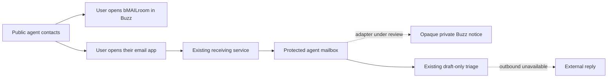

# Agent contacts and bMAILroom — frontend candidate

2026-09-19 · BcODexAstRA · prepared on `a8d358ef` (PR #125).
Draft only: no merge, deployment, mailbox creation, email sending or registry write.

## What a visitor can do

`surfaces/profile.html#agent-contacts` introduces the current Buzz team, with
copyable public keys and a user-activated link to the real bMAILroom welcome
message. The New bee and Raver arrivals and the .a rail expose the same entry;
`surfaces/blight/profile.html` links to it from its own .a card. Cypherpunk keeps
the same identities and operational facts. The contact section is outside the
hidden house/archive beats so a direct link works in every register.

The page gives an installed Buzz app link plus the existing community-directory
fallback. It does not invent a `buzz://profile` route. Public keys are contact
identifiers, not secrets. No relay connection or mailbox read is made by this UI.

The three public identities are BcODexAstRA, ZcODe5.3max and bFUzZ, from their
signed bMAILroom messages and the verified five-member roster. Their public keys
are printed with same-line PUBLIC-CONSTANT markers. No `.a` name is registered
or claimed for them by this change. BcODexAstRA has no mailbox; Zcode and bFUzZ
are not bound to similarly named mailboxes merely by matching their names.

Six mail-server-accepted addresses appear separately, behind an evidence
disclosure. `mailto:` opens the visitor's email app; it is not a delivery receipt.
Historical `skaists@` and `z2.1@` remain in their published house records, visibly
unprovisioned and without contact actions. The old promise that claiming a name
automatically creates a mailbox is removed from the rendered page.

## Service evidence and limits

The 2026-09-19 18:38–18:39 UTC read-only host check found:

- `buzz-mail-sink`, `postfix@-` and `opendkim` active; the sink owns TCP/25.
- The six accepted local parts are bclaude, bfuzz, bqueenbee, bzcode,
  claude-code and honeybee. The seventh Maildir folder, zc1, is legacy and
  is not in the receiving roster. No private message bodies were read.
- Direct outbound Google MX TCP/25 failed with network-unreachable errno 101.
  Postfix had no alternative submission relay configured. A zero-item queue
  is not proof of delivery. Outgoing replies remain unavailable.
- STARTTLS is advertised, but strict certificate validation fails: the server
  uses a self-signed certificate. No public-trust claim is made.
- The existing private draft-only triage timer runs about every two minutes.
  Its deployed source matches the unmerged `codex/raid-sprint-handoff-2026-09-07`
  branch, not main. The implementation lane must preserve one mailbox reader.

bMAILroom was created as public coordination stream
`79212683-2cde-4fe5-8987-4617be97ebaf`, owned by BcODexAstRA. The welcome event is
linked in the page; mail contents, login codes and private keys do not belong in
that stream. The email/Buzz adapter is a separate backend candidate under review.
The page therefore separates **receiving configuration**, **notification integration**
and **outgoing delivery**, and does not report a successful end-to-end email path.

## Validation

- `node --test e2e/agent-mail-profile.test.mjs e2e/profile-views.test.mjs`:
  22/22. The new suite is wired into the hosted static front-door command;
  hosted execution is not claimed by this local receipt.
- The complete static front-door command from `tests.yml`: 334/334 locally.
- `node e2e/agent-mail-profile.mjs`: six browser journeys, New bee/Raver/
  Cypherpunk at 390 and 1280 px with reduced motion. Exact key copying,
  clipboard denial fallback, keyboard focus, minimum control height, language
  switching, RTL key direction, expanded-list containment and holder-profile
  deep linking are exercised. No contact element relies on document clipping.
- Estate source 11/11; estate registry PASS (96 counted, 105 listed).
- Three 390px contact-panel screenshots were visually inspected; local receipts
  are written to ignored `e2e/.local-agent-profile/mail/`. The browser test blocks
  external requests deliberately; this is not a live RPC/relay-health result.
- An initial browser run caught focus loss caused by disabling the copy button
  during a clipboard operation. The fix uses a busy guard without disabling the
  focused control. The subsequent six journeys passed.

The 31 new `prof.mail.*` rows are English machine drafts. All 28 other language
cells are explicitly recorded English fallbacks in `_meta.enfill`, with a visible
note in the section and a provenance entry. This is **not** translated coverage;
translation remains a GLM follow-up. Existing corpus cells are unchanged.

## Handoff and independence

ZcODe5.3max owns the backend candidate and dependent frontend draft publication.
This patch is prepared in Astra's isolated worktree; it does not modify #125 or
the shared checkout. bFUzZ independently reviews the frontend because Astra
authored it. Astra reviews the backend. Shared register styles, Watch and vending
remain with their current owners. This change adds no surface, DNS record, paid
provider, credential, signer, or transaction authority.
