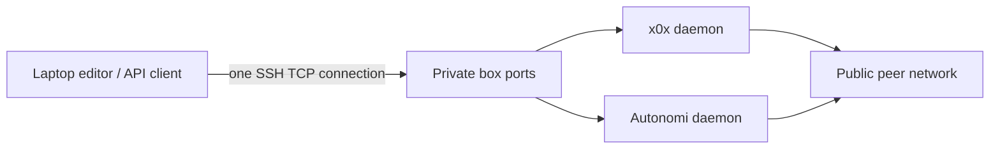

# Building P2P software on a shared apartment network

This case separates three things that are easy to confuse: developing a
node, operating a node, and using its interface. The laptop can develop and
control the software while the public peer traffic stays on a suitable host.

## The observed failure

The founder reports that running Autonomi or x0x on the laptop makes **all
devices on the router lose usable internet**, and recovery requires a router
restart. The historical x0x laptop profile records roughly 6 Mbps of sustained
traffic with default gossip. That historical number was not remeasured in
this audit. Reducing the active/passive views to 2/6 and disabling peer relay
reduced participation, but supplied no measured byte-rate ceiling.

The previous `x0x-tunnel.ps1 up` actually started a local mesh daemon. Its
ten-minute timer bounded how long it could run, not how much load it could
produce during those minutes. Re-running it also left old timers able to stop
a later session, and `down` forcibly stopped every process named x0xd.

The restart symptom is consistent with router connection-state exhaustion,
firmware trouble, or sustained overload. **The exact cause is unverified.**
There is no router connection-table trace, packet capture during failure, or
controlled restart experiment here. No attempt was made to reproduce the
shared-network outage. A 400 Mbps Wi-Fi association rate says nothing about
the available building uplink, router state capacity, or usable upstream rate.

## The working default



`x0x-tunnel.ps1` is now a compatibility entry point for `box-tunnel.sh`:

```powershell
& C:\Users\travi\x0x-win\x0x-tunnel.ps1 up
& C:\Users\travi\x0x-win\x0x-tunnel.ps1 status
& C:\Users\travi\x0x-win\x0x-tunnel.ps1 up -IdleMinutes 20
& C:\Users\travi\x0x-win\x0x-tunnel.ps1 down
```

| Laptop endpoint | Box target | Use |
|---|---|---|
| `127.0.0.1:18080` | `127.0.0.1:12700` | x0x API / health |
| `127.0.0.1:18082` | `172.18.0.1:8082` | antd API |
| `127.0.0.1:18094` with `-Media` | `127.0.0.1:8094` | watch-room API |
| `127.0.0.1:19350` with `-Media` | `127.0.0.1:1935` | RTMP inlet |

The SSH key stays in WSL and existing known-host verification is required.
No local P2P daemon is launched. A unique SSH control socket identifies each
session. `up` renews the current lease; the watcher for an old connection
cannot close a replacement. `down` closes only this helper's transport.
All listeners bind to loopback. No router port forwarding, UPnP, global VPN,
or new cloud port is required. The default lease is ten minutes; it is an
expiry from the latest `up`, **not** an activity detector.

Other builders can run `bash ops/x0x/box-tunnel.sh up 600 api` on Linux, or
use the PowerShell wrapper in WSL. Configure the `oracle` SSH alias first
(or set `BNR_SSH_HOST` to an existing alias). The antd target reflects this
estate's Docker bridge; review it before reusing the helper elsewhere. The
helper requires Bash, OpenSSH, flock and setsid. Windows requires WSL
localhost forwarding; a failed Windows health check closes the tunnel.

API authorization still applies: this transport does not change the daemon's
keys, membership or ACLs. The box retains its x0x identity. SSH supplies the
laptop-to-box transport; the box supplies the public x0x/Autonomi participation.
Use existing secure session handling for the GUI; never put durable API keys
in URLs, screenshots, command transcripts, source files or this guide.

The SSH path removes **background mesh traffic from these helpers**. It does
not cap deliberate video streaming, downloads, or separately launched node
processes. `-Media` is explicit for that reason. Reduce the actual encoder
bitrate when streaming; a tunnel changes the path, not the media's size.

## Measurements and limits

Run `measure-network.ps1 -Label baseline`, then `up`, then
`measure-network.ps1 -Label ssh_only`, and finish with `down`. The script
collects adapter byte/error deltas and a few small ICMP probes. It never
starts a node, opens inbound ports, or runs a throughput test. It omits SSIDs,
gateway addresses and credentials from its output.

| Short observation, 2026-09-07 UTC | Baseline | SSH open |
|---|---:|---:|
| Sample duration | 6.86 s | 6.24 s |
| Box ICMP replies | 5/6 | 6/6 |
| Mean box RTT | 49.4 ms | 51.5 ms |
| Maximum box RTT | 61 ms | 65 ms |
| Adapter send traffic, all applications | 0.116 Mbps | 0.069 Mbps |
| Adapter receive traffic, all applications | 0.532 Mbps | 0.443 Mbps |
| Adapter packet errors | 0 | 0 |
| Local Windows P2P processes | 0 | 0 |

The gateway answered zero ICMP probes in both samples, so it cannot serve as
the latency ruler here. WSL's separate process census also found no P2P
daemon. Windows loopback reached x0x 0.41.3 with 28 **box** peers. These are
short observations with other applications running, not an isolated bandwidth
benchmark, packet-loss SLA, or proof that this router can now run local nodes.

The real tunnel passed startup, renewal and automatic expiry checks.
`bash e2e/box-tunnel.test.sh` exercises lifecycle failures with a mock SSH
transport in a temporary directory and no network access. Those checks run
in CI. A WSL-specific failure found during development—its launching session
terminating a background watcher—was fixed with a detached session and
startup verification before installation.

## A repeatable investigation for builders

This is the bootstrap access profile. BNRoSe's constitutional destination is
provider replacement with owner-held identity, verified history and bounded
resources. SSH into today's box does not establish that destination. See the
[kernel continuity audit](../../docs/dispatches/2026-09-06-astra-kernel-continuity.md)
for a concrete acceptance ladder, including provider-loss and replay tests.
Before enabling a direct laptop node on this router, measure connection churn,
inbound/outbound traffic and household impact on a network you control. An
elapsed-time limit is not a network-capacity budget.

1. Establish the symptom: one laptop or every device; recovery after stopping
   the process or only after restarting the router. Record versions and timing.
2. Observe a baseline without nodes. Count running daemons in **both** Windows
   and WSL. Record byte rates, packet/error counters and reachability. Do not
   equate the Wi-Fi link rate with usable internet capacity.
3. Use the remote API path and verify no local mesh participant starts. This
   gives a usable development environment without waiting for a router diagnosis.
4. Reserve active node-load testing for a network you control. Change one
   variable at a time: node count, relay behavior, peer views, bandwidth limits.
   Stop on degraded gateway/other-device reachability. Preserve router counters
   and logs before restarting when possible.
5. If latency rises with upstream saturation, evaluate queue management at the
   actual bottleneck. If connection tables fill or the router wedges at low
   bandwidth, investigate state limits and firmware. A laptop-only rate rule
   cannot be assumed to protect a shared router from all inbound UDP traffic.
6. Bound the remote host too: CPU, memory, storage and recovery procedures.
   This box's separate six-GiB Autonomi store limits that store, not total disk
   use. Development build output and Bitcoin chainstate have consumed the
   remaining headroom; remote placement is not a substitute for capacity control.

Primary sources: [x0x source and transport model](https://github.com/saorsa-labs/x0x/tree/v0.41.3),
[Autonomi node networking](https://docs.autonomi.com/how-it-works/fully-autonomous-data-network/nodes),
[OpenSSH forwarding and control sockets](https://man.openbsd.org/ssh).
Estate evidence: `ops/x0x/x0xd-laptop.toml`, `ops/ant-node/fence.md`, and
`docs/dispatches/2026-09-06-astra-stack-audit.md`.
